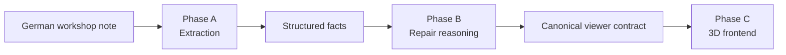

# Wolf Day: Damage Intelligence & 3D Vehicle Visualizer

From German workshop notes to structured damage facts, repair reasoning, and a multi-vehicle 3D visualization.

Built for Track B of the Wolf Day challenge: extract structured damage from ~1,000 anonymized German service and damage cases, visualize it in 3D, and analyze the corpus.

**Live MVP:** https://blechschaden.vercel.app

**Final presentation:** [presentation/presentation.md](presentation/presentation.md)

## System overview

The challenge is decomposed into three layers, each with a stable contract:



### Phase A: Extraction engine (`extraction/`)

Four approaches were implemented and benchmarked against ground truth: deterministic rules, classical ML (TF-IDF plus logistic regression), DeepSeek, and a hybrid that sends low-confidence rule results to the LLM.

The corpus turned out to be highly deterministic: all 785 ground-truth zone mentions appear literally in the text. The deterministic rules engine won. It scores 1.000 on zones, labels, insurance type and lifecycle stage, and about 0.84 on severity, the one field that has to be inferred. Severity acts as a control that shows where information is actually missing. Rules also run in under a millisecond, cost nothing, and cite exact textual evidence.

| Field | Rules | Classical ML* | DeepSeek | Hybrid |
|---|---:|---:|---:|---:|
| case_type | **1.000** | 1.000 | 1.000 | 1.000 |
| case_kind | **1.000** | 0.999 | 0.999 | 1.000 |
| zones micro-F1 | **1.000** | 0.818 | 1.000 | 1.000 |
| zones exact match | **1.000** | 0.591 | 1.000 | 1.000 |
| severity | **0.844** | 0.927* | 0.800 | 0.816 |
| insurance_type | **1.000** | 0.996 | 0.998 | 1.000 |
| lifecycle_stage | **1.000** | 1.000 | 1.000 | 1.000 |

\* The ML full-corpus number includes its training rows; the honest stratified holdout (799 train / 201 test) gives ML 0.747 vs. rules ≈0.835 on severity.

### Phase B: Repair / replace / assess reasoning

For each damage zone the system decides between `repair`, `replace`, and `assess`:

1. A deterministic explicit-action pass. Measured phrase families like `Austausch statt Instandsetzung` resolve about 22% of damage cases with zero API calls.
2. DeepSeek per zone for the rest, with sibling-zone context and consistency instructions.
3. Strict validation. JSON and enum checks, evidence must occur verbatim in the original note, retries, and conservative degradation to `assess` (with `insufficient_information` and `needs_review` states).

There is no official repair/replace ground truth, so no accuracy score is invented; results are sanity-reviewed instead. The recommendation distribution is **assess 49.4% / repair 34.3% / replace 16.3%**. The high assess rate is intentional: the system does not force an answer the note doesn't justify.

### Phase C: 3D frontend (`frontend/`)

Next.js with React Three Fiber, deployed on Vercel:

- A dashboard over all **1,000 cases** with filters (kind, severity, action, archetype) and full-text search.
- Case detail pages with an interactive 3D viewer: drag or scroll to orbit, click a zone to focus the camera and expand its evidence.
- **5 generated vehicle archetypes** (hatchback, wagon, suv, mpv, transporter) covering all 450 damage cases.
- A **22-zone semantic overlay** authored in canonical vehicle space and self-calibrated onto each mesh via Box3 bounds, independent of the generated meshes' (unreliable) object names.
- Visual encoding: replace is red, repair amber, assess blue; severity controls overlay opacity.

The frontend is a pure consumer. It performs no extraction, no LLM calls, and has no ground-truth access. It reads a canonical `ViewerCase` contract built by [frontend/scripts/build_viewer_cases.py](frontend/scripts/build_viewer_cases.py) from the Phase B output.

### 3D asset pipeline

Standardized reference images, one per archetype, feed Hunyuan3D-2.1 on the provided NVIDIA RTX PRO 6000 (96 GB VRAM). Outputs are normalized (canonical axes, wheels on z=0, uniform length) and decimated from roughly 392k to 140k vertices into ~5 MB GLBs served from `frontend/public/models/`.

## Repository layout

```text
extraction/            Phase A and B: rule engine, ML baseline, LLM paths,
                       benchmark harness, reasoning pipeline, results/
frontend/              Phase C: Next.js app (dashboard and 3D viewer),
                       build_viewer_cases.py, GLB normalization script
data/                  Challenge dataset (kit and 300-case subset)
assets/                Reference images, raw and normalized GPU outputs
presentation/          Final presentation and dashboard screenshots
reference-demo/        Original starter-kit reference demo (untouched)
```

## Running things

### Frontend

```bash
cd frontend
yarn
yarn dev        # http://localhost:8083
```

Static data lives in `frontend/public/data/viewer_cases.json`, built from Phase B output. No API or env vars needed.

### Extraction pipeline

```bash
cd extraction
uv sync                                   # Python deps (uv project)
export DEEPSEEK_API_KEY=...               # only needed for the LLM approaches
uv run python run_benchmark.py            # Phase A benchmark (rules/ML/LLM/hybrid)
uv run python run_reasoning.py            # Phase B repair/replace/assess
uv run python ../frontend/scripts/build_viewer_cases.py   # rebuild the viewer contract
```

LLM calls are disk-cached under `extraction/results/` (the cache is gitignored; predictions and metrics are committed).

## Key engineering decisions

1. Inspect the data before choosing a model
2. Benchmark rules, ML, LLM and hybrid, then use the simplest measured winner
3. Separate facts (extraction) from recommendations (reasoning)
4. Use deterministic logic before probabilistic reasoning
5. Make `assess` a valid outcome instead of forcing certainty
6. Validate model output, including evidence against the source text
7. Decouple semantic zones from mesh topology
8. Reduce 9 visual archetypes to 5 meaningful ones
9. Ship static JSON before backend infrastructure
10. Keep the future production architecture modular, not microservice-heavy

## Known limitations

- The extraction engine is an enumeration tuned to this corpus. Real unseen phrasing needs OOD detection and a regression suite.
- No official repair/replace ground truth exists; expert labelling is required before production claims.
- Zone overlays are hand-authored approximations, not calibrated per panel.
- No persistence, auth, or background jobs yet (Supabase, JWT, RLS and a queue are the documented next steps).
- Full `freitext` ships in the public JSON. Acceptable for synthetic challenge data, not for real PII.

## Corpus findings

1,000 cases: 450 damage, 550 service, 785 zone mentions over a fixed 22-zone ontology, 49 make/model combinations from 8 manufacturers. Every damage-zone mention is literally present in the text; severity labels never appear literally and must be inferred.

## Contributing

Contributions are welcome; this repo is shared for learning. The full guide is in [CONTRIBUTING.md](CONTRIBUTING.md). The short version:

1. Open an issue (bug or feature template), or claim an existing one
2. Fork, branch off `main`, make a minimal change
3. Fill in the PR template, with benchmark numbers for pipeline changes or a build and screenshot for frontend changes
4. A maintainer reviews before merge

Licensed under the [MIT License](LICENSE).
