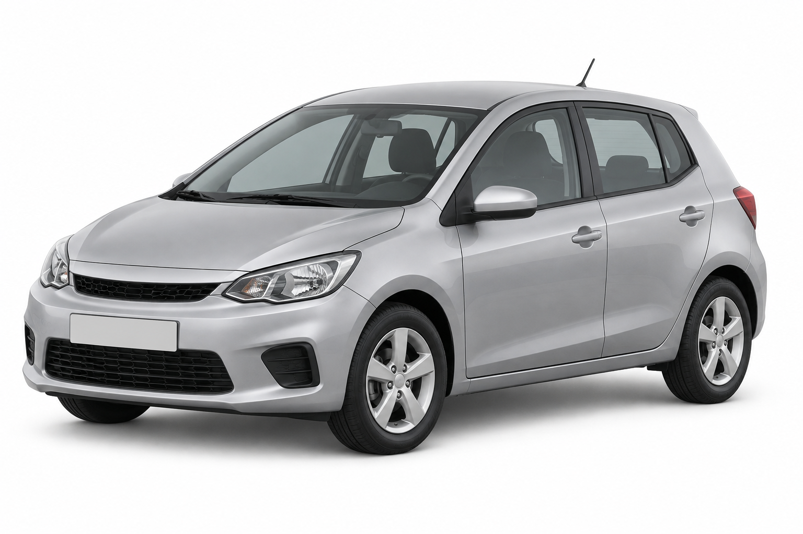
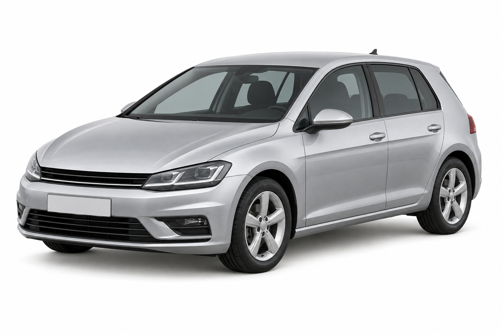
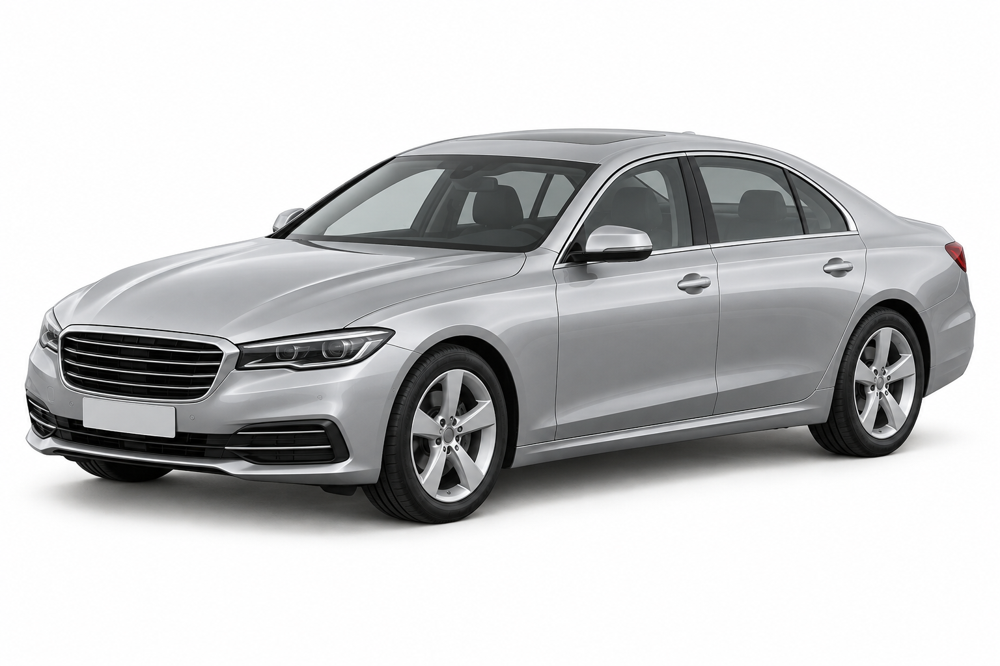
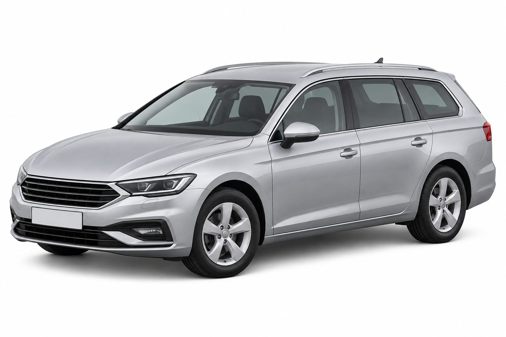
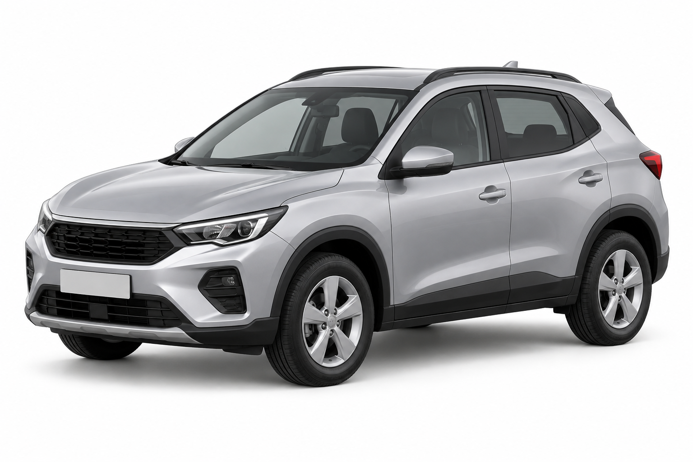
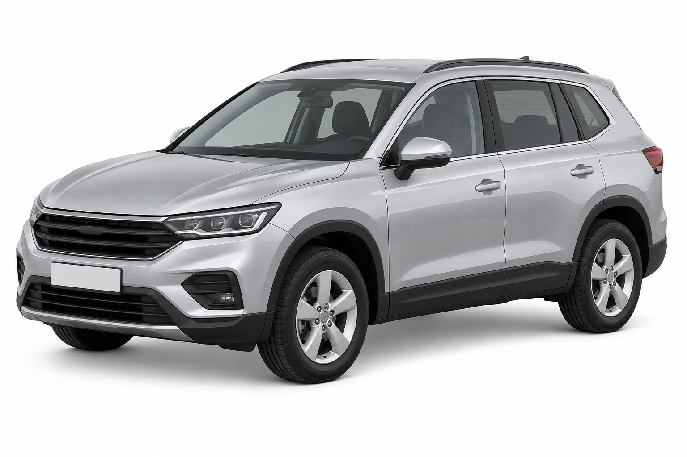
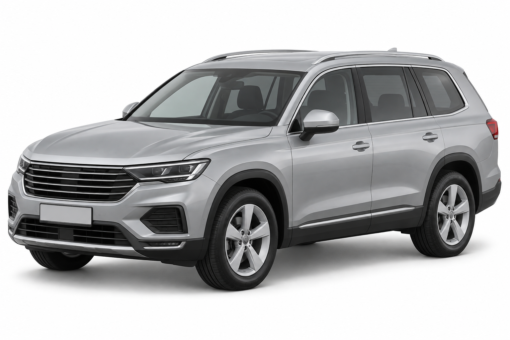
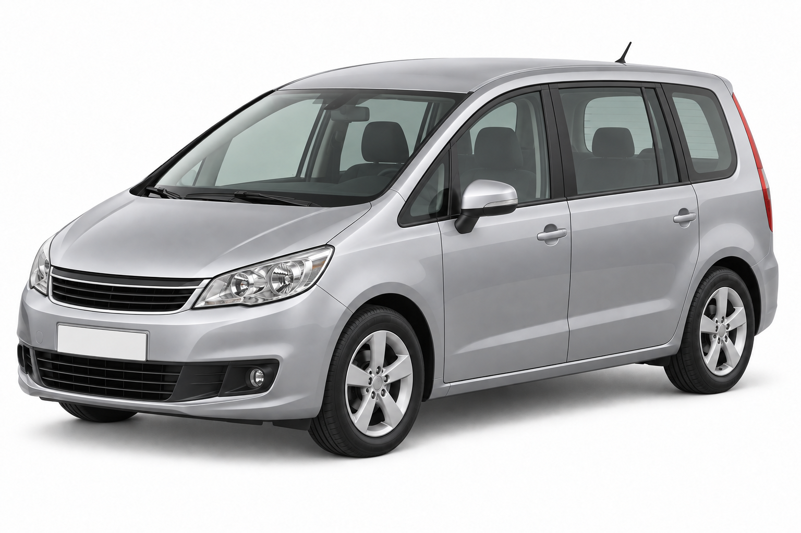
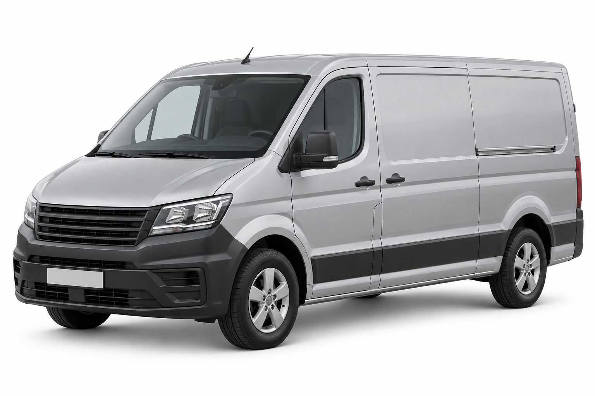

# Car archetype reference images

Nine reference images matching `car_archetypes.md`. Application code was not changed.

Each PNG shows one undamaged silver-gray vehicle on a white background from a front-left three-quarter view. Use each file separately as input to an image-to-3D model. These are generic archetype illustrations, not exact make/model reconstructions. The white backgrounds are opaque, not transparent alpha cutouts.

## Files

| Archetype | Reference image |
|---|---|
| Kleinwagen | [01-kleinwagen.png](01-kleinwagen.png) |
| Kompaktklasse | [02-kompaktklasse.png](02-kompaktklasse.png) |
| Limousine | [03-limousine.png](03-limousine.png) |
| Kombi | [04-kombi.png](04-kombi.png) |
| Kleines SUV / Crossover | [05-kleines-suv-crossover.png](05-kleines-suv-crossover.png) |
| Kompakt-SUV | [06-kompakt-suv.png](06-kompakt-suv.png) |
| Grosses SUV | [07-grosses-suv.png](07-grosses-suv.png) |
| Van (MPV) | [08-van-mpv.png](08-van-mpv.png) |
| Transporter | [09-transporter.png](09-transporter.png) |

## Usage and limits

- Start with `04-kombi.png` to verify generation, export, geometry cleanup and damage-zone mapping end to end.
- Images are independently framed; they are not to a common physical scale. Normalize orientation and scale after generating the meshes.
- Inspect the generated rear and opposite side. A single reference image cannot specify hidden geometry exactly.
- The MPV reference was corrected to conventional hinged rear passenger doors. The Transporter has a sliding cargo door and represents a medium panel van; it does not precisely represent every Caddy/Sprinter variant in the data.
- No damage is painted into these references. Add verified zone overlays to the resulting 3D assets.
- The references have been visually reviewed but have not yet been tested through the GPU image-to-3D pipeline.
- Exact generation prompts and the MPV correction prompt are preserved in [manifest.json](manifest.json).

## Preview

### Kleinwagen

### Kompaktklasse

### Limousine

### Kombi

### Kleines SUV / Crossover

### Kompakt-SUV

### Grosses SUV

### Van (MPV)

### Transporter

