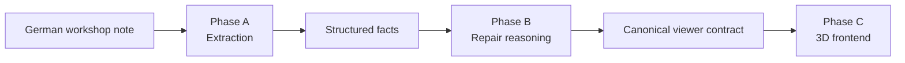
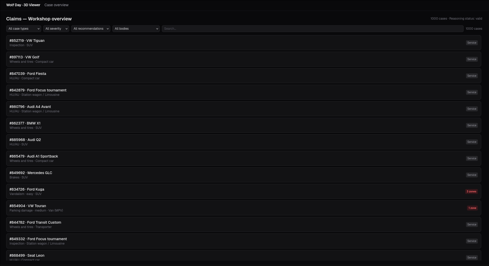
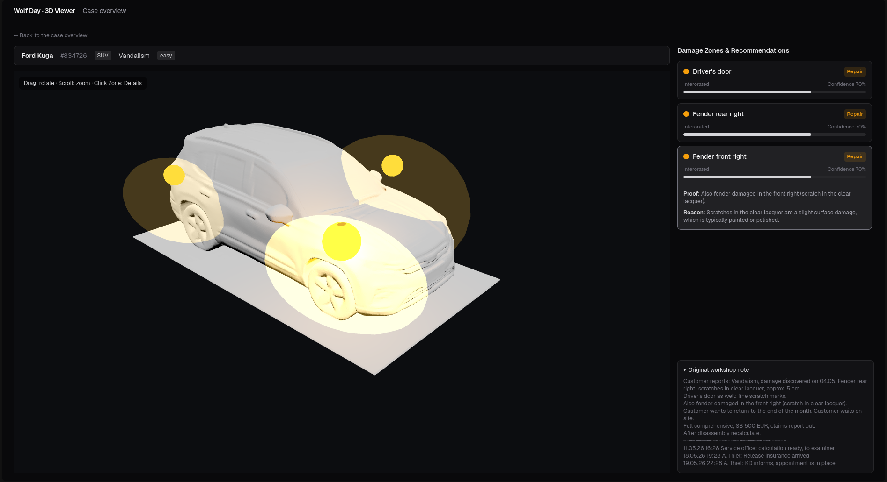
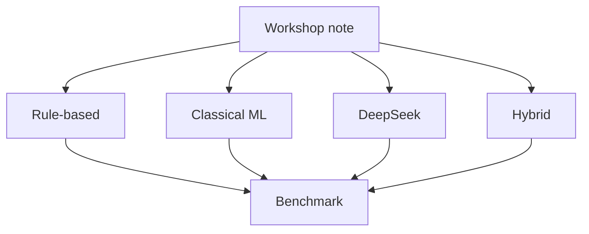
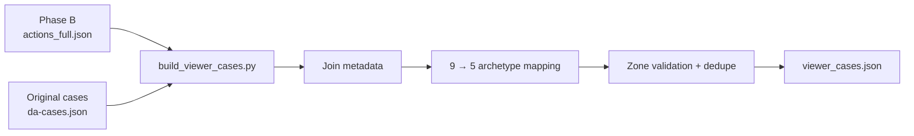
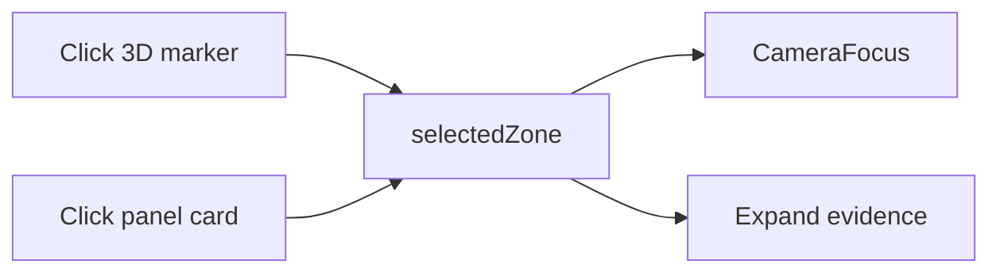
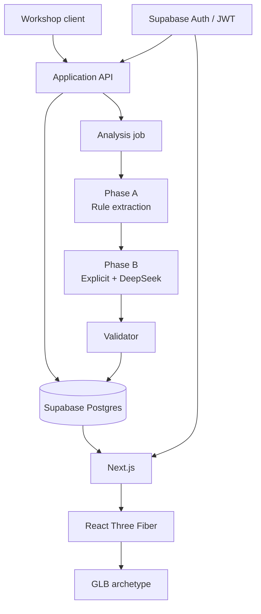
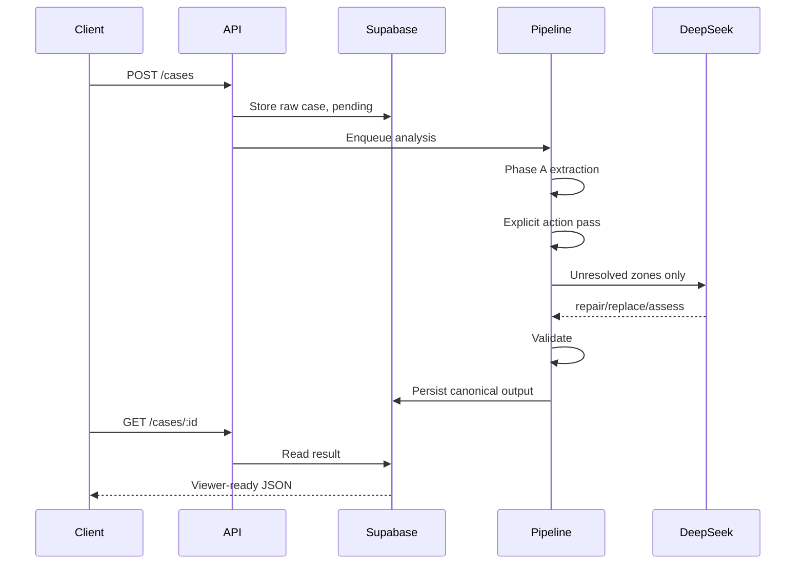

# Wolf Day — Damage Intelligence & 3D Vehicle Visualizer

> **German workshop notes → structured damage facts → repair reasoning → multi-vehicle 3D visualization**

**Live MVP:** https://blechschaden.vercel.app

---

# 0. What I Built

I decomposed the challenge into three layers:



## Current state

### Implemented
- Dataset/schema exploration
- Four extraction approaches + benchmark harness
- Production rule-based extraction engine
- Repair / replace / assess reasoning layer
- Validation, caching, retries, confidence, review states
- Full-corpus reasoning output
- Vehicle archetype analysis
- Remote NVIDIA GPU setup
- Hunyuan3D-2.1 image-to-3D generation
- 5 normalized/decimated GLB vehicle archetypes
- Public Next.js frontend on Vercel
- Dashboard over all 1,000 cases
- Filters + search
- Case detail pages
- 3D vehicle viewer
- 22-zone semantic overlay layer
- Clickable damage zones + camera focus
- Recommendation / confidence / evidence panel

### Not implemented yet
- Supabase persistence
- Authentication / JWT
- Row Level Security
- Background job queue / async ingestion API
- Production-grade semantic zone calibration
- Production observability / monitoring

---

# 1. Live Demo

## Dashboard



The current dashboard shows all **1,000 cases** and supports:

- case-kind filter,
- severity filter,
- recommendation filter,
- vehicle-body filter,
- full-text search over make/model/case id/kind/note,
- direct navigation to a case.

Service cases show a gray `Service` badge.

Damage cases show the number of damaged zones.

---

## Case detail



Each damage case shows:

- vehicle make/model,
- visual archetype,
- case kind,
- severity,
- generated 3D car,
- all detected damage zones,
- repair / replace / assess recommendation,
- action provenance,
- confidence,
- source evidence,
- reasoning,
- original German note.

The 3D view supports:

```text
drag → rotate
scroll → zoom
click zone → focus camera + expand details
click panel → focus same zone in 3D
```

---

# 2. Why I Started With the Data

Before choosing a model, I inspected the dataset.

| Item | Value |
|---|---:|
| Total cases | **1,000** |
| Damage cases | **450** |
| Service cases | **550** |
| Damage-zone mentions | **785** |
| Fixed damage zones | **22** |
| Manufacturer × model pairs | **49** |
| Manufacturers | **8** |

## Important corpus finding

For most extraction fields, the label-bearing vocabulary is extremely bounded.

| Observation | Result |
|---|---:|
| GT zone mentions literally present in `freitext` | **785 / 785** |
| Damage cases where all GT zones are present in text | **450 / 450** |
| Damage-kind vocabulary represented explicitly | **7 / 7** |
| Extra zone mentions outside GT | **0 / 450** |

That changed my first question from:

> “Which LLM should I use?”

to:

> **“Do I need an LLM at all for factual extraction?”**

---

# 3. Phase A — Extraction Engine

I implemented and benchmarked four approaches.



---

# 4. Approach 1 — Rule-Based

The rule engine extracts:

```text
case_type
case_kind
zones
severity
insurance_type
lifecycle_stage
```

## Example: overlapping zones

A naive substring search would double-match:

```text
Stoßstange vorne links
```

as both:

```text
Stoßstange vorne links
Stoßstange vorne
```

So the extractor processes zones longest-first and masks matched text:

```python
for zone in ZONES_LONGEST_FIRST:
    idx = work.find(normalize(zone))

    if idx == -1:
        continue

    mentions[zone] = normalize(zone)

    work = (
        work[:idx]
        + "~" * len(zone)
        + work[idx + len(zone):]
    )
```

Other defensive rules include:

- safe word boundaries for `TK` / `VK`,
- case-kind traps,
- weighted severity cues,
- lifecycle extraction from production metadata.

---

# 5. Approach 2 — Classical ML

Baseline:

```text
TF-IDF word 1–2 grams
        ↓
Logistic Regression
```

For zones:

```text
one binary classifier per damage zone
```

Why test it?

> To see whether the extraction vocabulary could be learned from examples instead of encoded directly.

Why it lost:

- 22 zone labels,
- some with relatively few positives,
- while the exact zone names were already in the text.

The statistical model was learning a harder version of something deterministic matching already solved.

---

# 6. Approach 3 — DeepSeek Extraction

I implemented a constrained extraction path:

```text
deepseek-chat
temperature = 0
strict JSON
fixed ontology
evidence validation
retry on invalid output
429/5xx backoff
disk cache
8 workers
token + cost tracking
```

Full run:

```text
1,000 cases
≈ 12 minutes
≈ $0.24
0 final invalid outputs
```

DeepSeek was very strong.

But it was not the best production choice for extraction.

---

# 7. Approach 4 — Hybrid

The hybrid idea:

```text
rules
  ↓
low confidence?
  ↓ yes
DeepSeek fallback
```

It actually made severity worse.

Why?

Because low confidence often meant:

```text
missing information
```

not:

```text
hard language
```

> **A larger model cannot recover information that is not present in the input.**

---

# 8. Phase A Benchmark

| Field | Rules | Classical ML* | DeepSeek | Hybrid |
|---|---:|---:|---:|---:|
| case_type | **1.000** | 1.000 | 1.000 | 1.000 |
| case_kind | **1.000** | 0.999 | 0.999 | 1.000 |
| zones micro-F1 | **1.000** | 0.818 | 1.000 | 1.000 |
| zones exact match | **1.000** | 0.591 | 1.000 | 1.000 |
| severity | **0.844** | 0.927* | 0.800 | 0.816 |
| insurance_type | **1.000** | 0.996 | 0.998 | 1.000 |
| lifecycle_stage | **1.000** | 1.000 | 1.000 | 1.000 |

\* The ML full-corpus number includes its training rows and is not a fair generalization metric.

### Honest holdout

```text
799 train
201 holdout
stratified by case_kind × severity
seed = 20260918
```

Severity:

```text
Rules ≈ 0.835
Classical ML = 0.747
```

---

# 9. Why Did Rules Score So Highly?

The perfect scores looked suspicious, so I audited them.

The correct interpretation is **not**:

> “Rules understand arbitrary German.”

It is:

> **The synthetic corpus preserves a small, highly deterministic label-bearing vocabulary.**

Severity acts as a control.

The literal labels:

```text
leicht
mittel
schwer
```

appear in:

```text
0 / 450 damage notes
```

Severity has to be inferred.

That is exactly where performance drops.

### Selected severity results

| Kind | Rules | DeepSeek |
|---|---:|---:|
| Parkschaden | **110 / 110** | 107 / 110 |
| Auffahrunfall | **62 / 62** | 59 / 62 |
| Rangierschaden | **76 / 76** | 73 / 76 |
| Vandalismus | **48 / 48** | 47 / 48 |
| Wildunfall | **44 / 44** | 39 / 44 |
| Hagelschaden | 21 / 55 | 20 / 55 |
| Steinschlag | 19 / 55 | 15 / 55 |

The difficult categories are difficult for both methods.

That suggests an information ceiling rather than simply a weak model.

---

# 10. Phase A Decision

## Production extractor: deterministic rules

Why:

```text
best measured accuracy
sub-millisecond inference
zero API cost
no network dependency
exact textual evidence
easy auditability
```

Trade-off:

> The system is an enumeration and may fail on real unseen phrasing.

I would revisit the architecture if:

- production notes stop naming zones directly,
- new case kinds appear,
- typo/vocabulary drift becomes material,
- OOD failure rate becomes unacceptable.

---

# 11. Phase B — Repair / Replace / Assess

Phase A asks:

> **What is in the note?**

Phase B asks:

> **What should probably happen to the damaged part?**

Allowed actions:

```text
repair
replace
assess
```

Important limitation:

> There is no official repair / replace ground truth.

So Phase B is a **reasoning/recommendation layer**, not a classifier with a proven accuracy score.

---

# 12. Deterministic Reasoning Before LLM Reasoning

I measured explicit repair-action phrases first.

| Family | Example | Cases | Decision |
|---|---|---:|---|
| F1 | `Austausch statt Instandsetzung` | 28 | replace |
| F2 | `Reparatur nicht möglich, Austausch nötig` | 8 | replace |
| F3 | `Reparatur laut Prüfung möglich` / `Harzreparatur angeboten` | 25 | repair feasibility |
| F4 | `ob Instandsetzung reicht` | 46 | assess |

Union:

```text
100 / 450 damage cases
≈ 22%
```

So around 22% of damage cases can be handled deterministically before any API call.

---

# 13. Avoiding False Repair Signals

Naive keyword matching would be dangerous.

Examples:

```text
Bitte KVA vor Reparatur abstimmen
Kunde fragt nach Reparaturdauer
Ersatzteil eingetroffen
```

These phrases contain repair-related words but do not mean:

```text
repair this damaged part
```

So the explicit pass uses measured phrase families and context.

---

# 14. Phase B Architecture

```mermaid
flowchart TD
    A[Phase A structured case]
    A --> B{Explicit action evidence?}
    B -->|Yes| C[Deterministic decision]
    B -->|No| D[DeepSeek per zone]
    C --> V[Validator]
    D --> V
    V -->|Valid| O[ZoneAction]
    V -->|Ambiguous| R[needs_review / assess]
    V -->|Failure| F[failed → conservative assess]
```



DeepSeek input:

```text
requested zone
severity
case kind
insurance context
full workshop note
other zones as consistency context
```

Output:

```json
{
  "zone": "Stoßstange vorne rechts",
  "action": "replace",
  "action_source": "inferred",
  "confidence": 0.78,
  "reason": "...",
  "evidence": "..."
}
```

---

# 15. DeepSeek Output Is Validated

The model is not trusted blindly.

Validation includes:

```text
✓ valid JSON
✓ enum validation
✓ no extra / missing zones
✓ evidence must occur in original freitext
✓ source/action consistency
✓ confidence clamping
✓ retry on invalid output
✓ API failures degrade to assess
```

Examples:

```text
unknown action
→ assess

assess
→ insufficient_information

evidence cannot be verified
→ needs_review

API failure
→ assess, confidence 0.1, failed
```

---

# 16. A Real Prompt Failure Changed the Design

Initial design:

```text
one independent DeepSeek call per zone
```

During review I found:

```text
same case
similar damage descriptions
different zones
→ inconsistent recommendations
```

Instead of replacing the architecture with one huge case-level prompt, I made the smallest change:

```text
per-zone reasoning
+
sibling-zone context
+
consistency instruction
```

That became prompt v2.

```text
design
→ observe
→ diagnose
→ smallest change
→ re-test
```

---

# 17. Phase B Results

| Metric | Result |
|---|---:|
| Cases | **1,000** |
| Valid | **984** |
| Needs review | **16** |
| Failed | **0** |
| Damage-zone decisions | **785** |
| Service-case leakage | **0** |
| API calls | **624** |
| Cache hits | **27** |
| Invalid final outputs | **0** |
| Cost | **≈ $0.18** |
| Wall time | **≈ 15 min** |

## Recommendation distribution

```text
Assess   49.4%  █████████████████████████
Repair   34.3%  █████████████████
Replace  16.3%  ████████
```

The high `assess` rate is intentional.

The system does not force a repair/replace answer when the note does not justify one.

---

# 18. Phase B Evaluation

There is no official Phase B ground truth.

I therefore did **not** invent an accuracy score.

Manual sanity review:

```text
25 stratified cases
41 zone decisions
0 decisions judged wrong in that sample
```

This is a sanity check, not technician-level validation.

For production, I would require expert-labelled repair decisions.

---

# 19. Canonical Contract Between Intelligence and Frontend

The frontend does not know:

- regex logic,
- prompts,
- DeepSeek internals,
- ground truth.

It consumes:

```ts
export interface Damage {
  zone: string;
  action: "repair" | "replace" | "assess";
  action_source: "explicit" | "inferred" | "insufficient_information";
  confidence: number;
  reason: string;
  evidence: string;
}

export interface ViewerCase {
  id: string;
  case_id: number;
  vehicle_make: string;
  vehicle_model: string;
  vehicle_archetype:
    | "hatchback"
    | "wagon"
    | "suv"
    | "mpv"
    | "transporter";
  case_type: "damage" | "service";
  case_kind: string;
  severity: "leicht" | "mittel" | "schwer" | null;
  reasoning_status: string;
  created_at: string;
  freitext: string;
  damages: Damage[];
}
```

That contract is the boundary between the intelligence pipeline and the UI.

---

# 20. Phase C — Preparing Viewer Data

The viewer contract is built by:

```text
frontend/scripts/build_viewer_cases.py
```

Pipeline:



Validation result:

```text
1,000 cases
450 damage cases
0 unknown archetypes
0 unknown zones
0 duplicates
```

The frontend is a pure consumer.

It performs:

```text
no extraction
no DeepSeek calls
no ground-truth access
no German NLP
```

---

# 21. Vehicle Archetype Analysis

The original dataset contains:

```text
49 make/model combinations
8 manufacturers
9 initial body archetypes
```

Initial archetypes:

```text
Kleinwagen
Kompaktklasse
Limousine
Kombi
Kleines SUV / Crossover
Kompakt-SUV
Grosses SUV
Van / MPV
Transporter
```

For the visual layer, I reduced those 9 to 5:

```text
hatchback
wagon
suv
mpv
transporter
```

### Final coverage

| Visual archetype | Damage cases |
|---|---:|
| SUV | **138** |
| Hatchback | **118** |
| Wagon | **109** |
| Transporter | **50** |
| MPV | **35** |

All 450 damage cases resolve to one of the five.

---

# 22. Reference Vehicle Generation

I generated consistent reference images for each vehicle archetype.

Standardized framing:

```text
front-left three-quarter view
neutral silver/gray body
whole vehicle visible
no branding
wheels straight
doors closed
studio background
```

The goal was not exact make/model fidelity.

The goal was:

> **consistent image-to-3D conditioning for visually different body families.**

---

# 23. NVIDIA GPU Pod

Remote machine:

```text
Ubuntu 24.04.3 LTS
NVIDIA RTX PRO 6000 Blackwell Server Edition
96 GB VRAM
```

Access:

```bash
ssh wolf-gpu
```

Generation stack:

```text
Python
PyTorch / CUDA
Hunyuan3D-2.1
trimesh
```

---

# 24. Hunyuan3D-2.1 Asset Pipeline


Core generation:

```python
pipeline = Hunyuan3DDiTFlowMatchingPipeline.from_pretrained(
    "tencent/Hunyuan3D-2.1"
)

mesh = pipeline(image=reference_image)[0]
mesh.export("vehicle.glb")
```

Then:

```text
frontend/scripts/gpu/normalize.py
```

normalizes every model to:

```text
+x = front
+y = left
+z = up
wheels on z = 0
length ≈ 4.7 units
```

and decimates approximately:

```text
392k vertices
→
140k vertices
```

### Result

```text
5 GLBs
≈ 5 MB each
≈ 25 MB total
≈ 80 s generation/model
```

---

# 25. Why 5 Archetypes, Not 49 Models

The purpose of the 3D layer is not exact OEM reconstruction.

It is to preserve meaningful body geometry for the semantic damage ontology.

The mapping is:

```text
Kleinwagen + Kompaktklasse
→ hatchback

Limousine + Kombi
→ wagon

3 SUV groups
→ suv

Van / MPV
→ mpv

Transporter
→ transporter
```

Trade-off:

> a BMW 5-series sedan may render using the wagon family.

Benefit:

> five generated assets cover the full corpus and keep the system manageable.

---

# 26. Damage-Zone Visualization

Generated Hunyuan meshes do not contain reliable semantic object names such as:

```text
hood
driver_door
front_bumper
```

So I deliberately separated:

```text
3D geometry
```

from:

```text
damage semantics
```

The frontend owns one semantic zone layer for the fixed 22-zone ontology.

---

# 27. Self-Calibrating Zone Mapping

All zone definitions live in:

```text
src/lib/zones.ts
```

Each German damage zone has:

```text
center [x,y,z]
radius [rx,ry,rz]
```

in canonical vehicle space.

After the GLB loads, Three.js measures its real bounds:

```ts
THREE.Box3().setFromObject(scene)
```

Then `toWorld()` maps each canonical zone proportionally into the actual generated vehicle bounds.

```ts
const fx =
  (def.center[0] + CANON.halfLength) /
  (CANON.halfLength * 2);

const fy =
  (def.center[1] + CANON.halfWidth) /
  (CANON.halfWidth * 2);

return {
  center: [
    b.minX + fx * spanX,
    b.minY + fy * spanY,
    fz * b.maxZ,
  ],
  radius: [...]
}
```

Per-archetype overrides correct several body-specific positions.

### Why this matters

> The same semantic ontology survives different generated geometry without relying on mesh names.

---

# 28. What the Current 3D Overlay Actually Is

The current visualizer does **not** simulate dents.

Each damage zone renders:

```text
1 translucent additive ellipsoid
+
1 small opaque marker sphere
```

Visual encoding:

```text
replace → red
repair  → amber
assess  → blue
```

Severity controls ellipsoid opacity:

```text
leicht → 0.25
mittel → 0.40
schwer → 0.60
```

Confidence is shown in the UI as a progress bar.

Multiple damage zones render simultaneously.

---

# 29. Frontend Stack — Actual Implementation

| Area | Implementation |
|---|---|
| Framework | **Next.js 16.3.5, App Router** |
| Language | **TypeScript 5** |
| React | **React 19.2.8** |
| 3D | **React Three Fiber 9.7.0** |
| 3D engine | **Three.js 0.186.0** |
| Helpers | **@react-three/drei 10.7.8** |
| Styling | **Tailwind CSS 4** |
| Data | **Static `viewer_cases.json`** |
| Hosting | **Vercel** |
| Supabase | **not implemented yet** |
| Auth | **not implemented yet** |

The application was rebuilt as a minimal frontend rather than keeping the unrelated pre-existing template.

---

# 30. Current Routes

| Route | Purpose |
|---|---|
| `/` | Landing page |
| `/dashboard` | 1,000-case dashboard |
| `/cases/[id]` | Case detail + 3D viewer |
| `/_not-found` | 404 |

Data loading:

```text
viewer_cases.json
→ server-side Node fs read
→ module-level cache
→ server component
→ client components for interaction
```

No client-side data fetching is required.

---

# 31. Dashboard Design

The dashboard filters all 1,000 cases client-side.

Filters:

```text
case kind
severity
action
vehicle archetype
search
```

Search matches:

```text
vehicle make
vehicle model
case id
case kind
freitext
```

Implementation:

```text
useState
+
useMemo
+
in-memory array
```

At this dataset size, O(n) filtering over 1,000 cases is sufficient.

---

# 32. 3D Viewer Design

The viewer uses:

```text
<Canvas>
useGLTF()
OrbitControls
Box3 bounds
custom CameraFocus
```

Camera:

```text
Z-up
position = [3.4, -3.8, 2.3]
FOV = 42
```

Lighting:

```text
ambient light
2 directional lights
ground shadow
```

No HDR environment CDN is used.

Reason:

> The demo should survive unreliable event Wi-Fi.

---

# 33. Interaction

The overlay and side panel share one selected-zone state.



Clicking a zone:

- selects it,
- smoothly moves the camera target,
- expands its details.

Clicking the same zone again deselects it.

---

# 34. Frontend Data Flow — Implemented Now

```text
data/kit/dataset/da-cases.json ─┐
                                │
Phase B actions_full.json ──────┤
                                ▼
          build_viewer_cases.py
                 │
                 ▼
      public/data/viewer_cases.json
                 │
        ┌────────┴─────────┐
        ▼                  ▼
   /dashboard         /cases/[id]
                            │
                            ▼
                      CaseDetail
                       ├─ CarViewer
                       │   ├─ useGLTF
                       │   ├─ Box3
                       │   ├─ zones.toWorld()
                       │   └─ overlays
                       └─ DamagePanel
```

This is the system that is live today.

---

# 35. Deployment

Live URL:

```text
https://blechschaden.vercel.app
```

Deployment:

```bash
npx vercel deploy --prod --yes
```

Current production setup:

```text
no environment variables
no Supabase
no auth
no API routes
```

Assets:

```text
public/models/*.glb
public/data/viewer_cases.json
```

Rendering:

```text
/          → statically prerendered
/dashboard → statically prerendered
/cases/id  → server-rendered on demand
```

---

# 36. Frontend Metrics

```text
1,000 cases
450 damage cases
550 service cases

5 vehicle archetypes
22 semantic damage zones
3 actions
3 action sources
3 severity levels

viewer_cases.json ≈ 887 KB

5 GLBs × ~5 MB
≈ 25 MB total

~140k vertices/model
after decimation from ~390k

~900 lines of app code

local build ≈ 15 s
Vercel build ≈ 53 s
```

Headless verification:

```text
all 5 archetypes render
zero console errors
production routes/assets return 200
```

---

# 37. Why Static JSON Instead of Supabase First?

The viewer was the highest-risk product piece.

So I intentionally chose:

```text
Phase B output
→ validated static contract
→ frontend
```

before:

```text
database
auth
multi-user persistence
```

Benefit:

- no backend integration risk,
- zero environment-variable setup,
- same real Phase B data,
- faster vertical slice.

Trade-off:

> New data requires rebuilding the contract and redeploying.

---

# 38. Why React Three Fiber Instead of Vanilla Three.js?

R3F keeps:

```text
selection
overlay state
camera focus
panel interaction
```

inside the React component model.

That makes synchronization between:

```text
3D zone
↔
side panel
```

much simpler.

Trade-off:

> slightly less direct imperative control than raw Three.js.

---

# 39. Why Ellipsoid Overlays Instead of Mesh Segmentation?

Hunyuan output has arbitrary mesh topology.

Trying to segment every generated vehicle into:

```text
hood
door
fender
bumper
...
```

would have created a large manual asset-processing problem.

So I used:

```text
canonical zone geometry
+
bounds-driven calibration
```

Trade-off:

> placement is approximate.

Benefit:

> one semantic system works across all generated archetypes.

---

# 40. Known Limitations

### 3D / geometry
- zones are hand-authored approximations,
- not calibrated per real panel,
- some fender/door overlays overlap,
- generated vehicles have imperfect real-world proportions,
- transporter came out too squat,
- side mirrors are not reliable separate geometry.

### UX
- no loading spinner for GLBs,
- mobile works but is not optimized,
- no accessibility pass,
- filter state resets on navigation.

### Data/backend
- data is frozen at build time,
- no persistent writes,
- no Supabase,
- no authentication,
- no RLS,
- no multi-tenancy.

### Production safety
- full `freitext` is shipped in public JSON because this challenge data is synthetic;
- a real system would strip/secure PII server-side.

---

# 41. Intended Production Architecture — Not Yet Implemented



I would start this as a **modular monolith**:

```text
API
persistence
domain services
job orchestration
```

with clear internal boundaries.

I would not start with microservices.

Why?

> The system is not large enough yet to justify deployment, observability, and ownership complexity across multiple services.

The first piece I would separate later is the asynchronous reasoning worker because it has different latency and scaling characteristics.

---

# 42. Intended Production Data Flow



Important:

> DeepSeek should not execute every time someone opens a page.

Analysis should happen once, be persisted, and be read many times.

---

# 43. Main Engineering Decisions

1. **Inspect the data before choosing a model**
2. **Benchmark rules, ML, LLM and hybrid**
3. **Use the simplest measured winner**
4. **Separate facts from recommendations**
5. **Use deterministic logic before probabilistic reasoning**
6. **Make `assess` a valid outcome**
7. **Validate model evidence**
8. **Decouple semantic zones from mesh topology**
9. **Reduce 9 visual archetypes to 5**
10. **Ship static JSON before backend infrastructure**
11. **Normalize and decimate generated GLBs**
12. **Keep the first production architecture modular, not microservice-heavy**

---

# 44. Things That Failed / Changed My Mind

### Hybrid reasoning
Sounded better than it measured.

### Perfect rules
Looked suspicious, so I audited the corpus rather than trusting the score.

### Keyword scanning
My first repair scan missed `Reparatur` because of the chosen stem.

### Per-zone LLM calls
Produced an inconsistency, so sibling-zone context was added.

### Nine archetypes
Too redundant visually, especially across SUVs.

### GPU assets
Needed normalization, orientation correction and decimation before browser use.

### Process
I spent too much time validating the intelligence layer before shipping the product shell.

If I restarted the day:

```text
inspect
→ benchmark enough to decide
→ freeze
→ ship one complete vertical slice
→ improve
```

---

# 45. What I Would Do With the Full Five Weeks

## Week 1 — Real production data
Validate:

```text
synthetic vocabulary ≈ real workshop vocabulary
```

Measure:
- unseen phrasing,
- typos,
- abbreviations,
- OOD cases,
- drift.

## Week 2 — Extraction hardening
Add:
- OOD detection,
- fuzzy/character-level matching where justified,
- regression suite,
- confidence calibration,
- fallback routing.

## Week 3 — Repair-decision evaluation
Get technicians to label:

```text
repair
replace
assess
```

Measure:
- precision / recall,
- calibration,
- human disagreement,
- review rate.

## Week 4 — Semantic 3D system
Improve:
- panel-level calibration,
- heatmap projection,
- model normalization,
- camera focusing,
- asset quality.

## Week 5 — Product hardening
Add:
- Supabase persistence,
- auth,
- RLS,
- background jobs,
- monitoring,
- PII handling,
- user testing,
- deployment hardening.

---

# 46. Final Principle

The system uses different technologies for different uncertainty regimes:

```text
EXPLICIT FACTS
→ deterministic extraction

AMBIGUOUS SEMANTIC DECISION
→ constrained LLM reasoning

INSUFFICIENT INFORMATION
→ assess / human review

VEHICLE VARIATION
→ generated 3D archetypes

PRESENTATION
→ stable canonical contract
```

The goal was not:

> “Use AI everywhere.”

The goal was:

> **Measure where AI adds value, remove it where it does not, and keep the system boundaries clean.**

---
